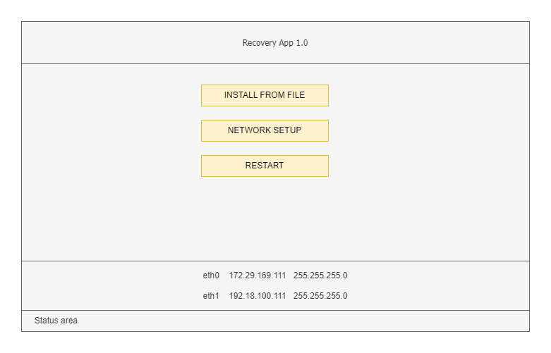
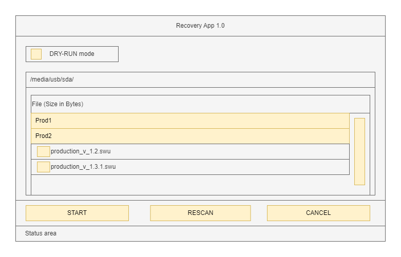
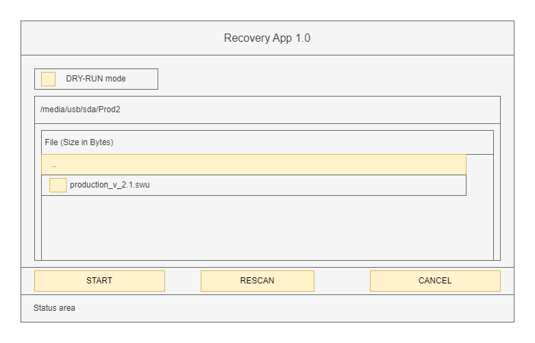
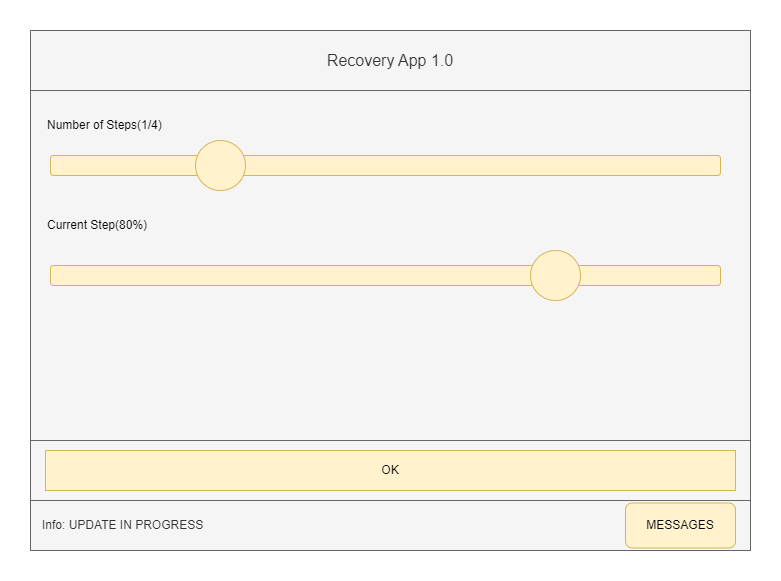
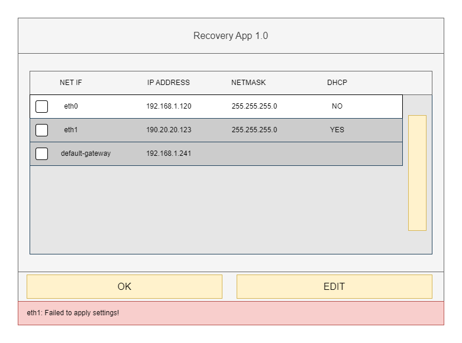
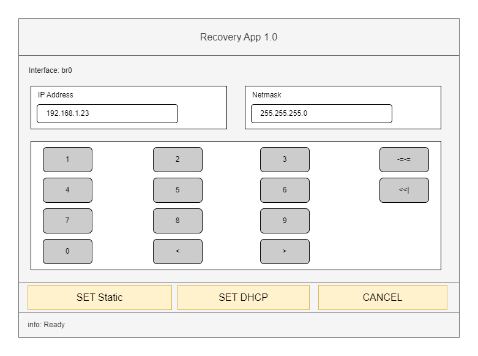
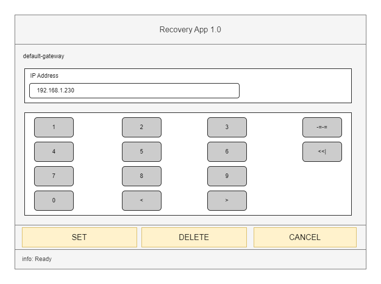
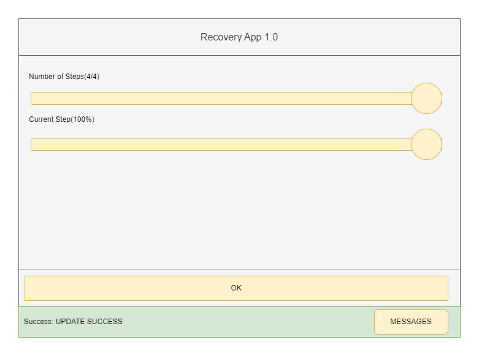
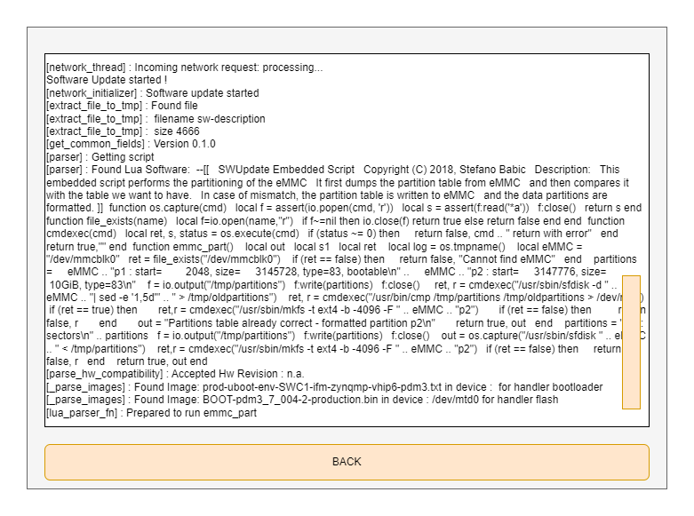

# Introduction

The recovery-gui utility provides a gui for swupdate.

# Features

It provides below screens:

* File browser screen to select an update file and start update.
* Progress screen to show update progress of local-update or 
network-update.
* Network setting screen to allow user to edit network settings.

The main screen looks like below:




## File browser

File browser displays path of the current directory. File browser supports
browsing sub-directories too. The sub-directories are grouped at top and 
alphabetically sorted. Below that files are shown and sorted 
alphabetically. Only "*.swu" files are visible.

File browser screen has rescan option to refresh the contents. File 
browser looks like below:



When inside of subdirectory, a directory entry with ".." label is 
available to go back to parent directory.



## Dry-run option

A checkbox for "DRY-RUN" mode is provided in file-browser screen. In this
mode selected file is processed completely by SWUpdate except for flashing
activity. This option is to test whether the installation of a swu file
is going to be successful or not.

## Update Progress

The update progress screen displays two progress bars

 * one progress bar for the current update step.
 * one progress bar to show percentage of current file being processed

When update is complete, success/failure status is shown.
For further debugging, user should refer to swupdate logs.



## Network settings

Network settings show list of available interfaces with configuration
(DHCP status, current IP address and netmask). It also shows configured
default-gateway. All entries have checkbox to select one entry and edit it.
At bottom, OK and EDIT buttons are available. OK button shows main screen.
Edit button shows edit screen.



The edit-screen shows IP-address and netmask text-boxes. Below
a virtual-keyboard is available.
At bottom, buttons are provided to configure interface to either have static
configuration or to be configured via a DHCP client.

To set static configuration:

* Set IP address and netmask using virtual keyboard.
* Press button "SET Static".

To configure using a DHCP client:

* Press button "SET DHCP". IP address and netmask are ignored.

On success, interface-list is shown with success message in notification area.
On failure, edit page is visible with error shown in notification area.



When default-gateway is selected for editing, edit screen looks slightly
different. Here a single text-box is available along with virtual-keyboard
to set gateway IP address.
At bottom, buttons are provided to set the address or delete existing
default-gateway IP-address.

To edit default-gateway:

* Set default-gateway IP-address in the field using virtual keyboard.
* Press button "SET".

To delete default-gateway:

* Press button "DELETE".

On success, interface-list is shown with success message in notification area.
On failure, edit page is visible with error shown in notification area.



## Status area

The recovery-gui supports fixed area on each screen for showing status
messages. Success messages are shown with green background. Error messages have
red background. Warning messages have yellow background. Other information
messages have grey background.



On update-progress screen, status-area provides a button to show details
of update. Clicking DETAILS shows swupdate logs about update.

These logs are available once update process is complete.



## Keypad support

It supports any keypad with arrow-keys(up, down, left, right) + Enter key.
User need to provide below keymapping for the keypad input device.

| Key | Linux mapped keycode |
|-|-|
| Left | KEY_LEFT |
| Right | KEY_RIGHT |
| Up | KEY_UP |
| Down | KEY_DOWN |
| Enter | KEY_ENTER |

# Customization 

This tool supports customization via a configuration-file and 
environment-variables.

## Configuration file

A sample configuration file is provided at 
[../config/config.txt](../config/config.txt).

The configuration file is a plain text file in INI format and contains
one setting per line. Setting has format as tag=value. Spaces are 
allowed between tag, '=' and value for better readability. Similarly user 
can put value in double-quotes too. 

For example, all below settings are valid:
```
NETWORK_INTERFACES = "eth0, eth1"
NETWORK_INTERFACES = eth0, eth1
NETWORK_INTERFACES=eth0,eth1

VERSION=1.0
VERSION = "1.0"
VERSION = "1.0-alpha"
VERSION = 1.0-alpha GreenShoots
```

Below is a list of optional supported tags:

| Setting | Description |
| :--- | :--- |
| VERSION | Application version to display at top. Default is "1.0". |
| APP_ID | Application title to display at top. Default is "Recovery App". |
| LOGO | Icon to be shown in header.|
| NETWORK_INTERFACES | Comma separated list of network interfaces. Network-settings shall be hidden when this setting is unavailable. |
| MEDIAPATH | Path to removable media root directory. Browsing outside of this path is not allowed. Default path is "/media/usb/sda". |
| KEYPAD_DEVICE | Path to keypad device. Default value is "/dev/input/keyboard0". Alternatively, users can create a link to actual keypad-device with this default-value instead of using this option. |
| THEME_COLOR | Color palette to be used by theme for foreground-elements. Default: orange color palette. Available palette colors: [orange, red, pink purple, indigo, blue, cyan, teal, green, brown] |

### Using a custom-color for THEME_COLOR

THEME_COLOR setting provides a limited set of colors supported directly by
LVGL color palette. For different colors, modify source code
in `rec_styles.c` and directly set the desired color into `ColorPrimary`
in `struct Styles`.

Depending on selected color, users may need to modify color of text from default
black color to white. This needs to be done manually for particular elements
by using `lv_style_set_text_color()` in their style.

## Environment variables

recovery-gui uses below optional environment variables:


| Variable | Default | Description |
| :--- | :---: | :--- |
| SCREEN_ORIENTATION_ANGLE | 0 | Screen rotation angle in degrees. Valid values are 0, 90, 180, 270. |
| SCREEN_WIDTH | 800 | Screen resolution width in pixel. |
| SCREEN_HEIGHT | 480 | Screen resolution height in pixel. |

**Note:** recovery-gui is tested with 1280x800 & 800x480 resolutions.
Along with it is tested with all 4 orientation angles. Also care has been
taken by using maximum layouts and scrollable-lists so that the GUI
is scaled appropriately. The layouts are using percent-values with optional
grow-factor wherever applicable to ensure appropriate scaling of child-elements.


# Dependencies

The recoverygui tool is dependent on below libraries and scripts.

* [SWUpdate](https://swupdate.org/): SWUpdate backend daemon provides update
functionality and libswupdate provides IPC functionality required for GUI.
* [LVGL](https://lvgl.io/): the latest version of the LVGL UI toolkit configured
appropriately for the product by modifying lv-conf.h
* pthreads and realtime extensions(librt).
* Scripts: recovery_gui needs below scripts to apply network settings.

Default scripts are available at [../scripts](../scripts) folder. 
If functionality provided by any of these scripts is not applicable for a 
product, that script should be reimplemented for that product. Yocto should
be used to deploy appropriate script to the product.

## recovery-edit-gateway.sh

Script to set/delete gateway IP address.

```
recovery-edit-gateway.sh --help
recovery-edit-gateway.sh --action=set --ip=[IP Address]
recovery-edit-gateway.sh --delete
```

Return value:

* 0 for success,
* else non-zero error code

Output: None

## recovery-get-dhcp-status.sh

Script to get DHCP status of an address.

```
recovery-get-dhcp-status.sh --help
recovery-get-dhcp-status.sh --address=[IP Address]
```
Return value:

* 0 when address configured via DHCP, 
* 1 when address configured as static,
* else error-code.

Output:

* "static" when address configured as static, 
* "dhcp" when address configured via DHCP

## recovery-set-dhcp.sh

Script to set interface as DHCP.

```
recovery-set-dhcp.sh --help
recovery-set-dhcp.sh --interface=[interface-name]
```

Return value:

* 0 for success,
* else non-zero error code

Output: None

## recovery-set-static.sh

Script to set interface as static. Optionally gateway address can also be set for that interface.

```
recovery-set-static.sh --help
recovery-set-static.sh --interface=[interface-name] --ip=[IP Address]
recovery-set-static.sh --interface=[interface-name] --ip=[IP Address] --gateway=[IP Address]
```

Return value:

* 0 for success,
* else non-zero error code

Output: None

## recovery-check-bridge-interface.sh

Script to check if interface is bridge, or part of a bridge

```
recovery-check-bridge-interface.sh --help
recovery-check-bridge-interface.sh --interface=[interface-name]
```

Return value: 

* 0 when interface is itself a bridge or not part of bridge,
* 1 when interface is part of bridge,
* else error-code

Output:

* "bridge [interface-name]" when interface is itself a bridge,
* "non-bridge [interface-name]" when interface is not part of a bridge,
* "part-of-bridge [interface-name]" when interface is part of bridge

# Coding style

This utility is written using 
[linux kernel coding style](https://github.com/torvalds/linux/blob/master/.clang-format).
